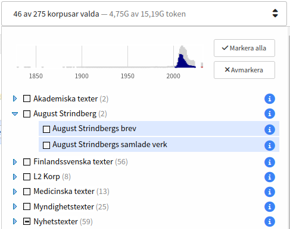
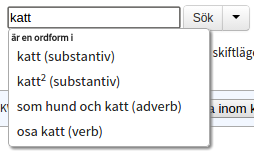
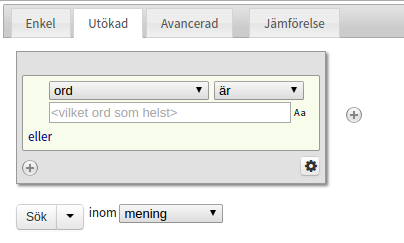
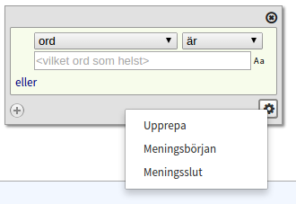
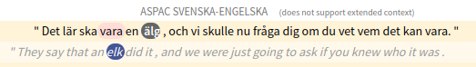
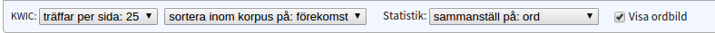
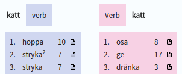

## Introduction

This is a user manual for the corpus search tool  [Korp](http://spraakbanken.gu.se/korp/). Before you continue reading
we recommend that you visit the Korp page and do some test searches in order to get a rough picture of how the interface
works.

There are even some Korp exercises available for download (although only in Swedish)
[here](https://svn.spraakdata.gu.se/repos/lb/trunk/sbkhs/pub/exercises/korp_ovningsuppgifter-hw17.pdf),
[here](https://svn.spraakdata.gu.se/repos/lb/trunk/sbkhs/pub/exercises/korp_ovningsuppgifter.pdf)
and [here](https://svn.spraakdata.gu.se/repos/lb/trunk/sbkhs/pub/exercises/korp_ovningsuppgifter_2012.pdf).

## Different Korps

The material in Korp is divided into different modes. The default mode holds material written in contemporary Swedish
(from the 1900's and newer). On the very top of the page, above the Korp logo, you can find links to the other modes, including older Swedish texts, material in different languages and parallel corpora. The functionality can vary between the different modes and this manual focusses on Korp's default mode.

## The corpus selector

To the right of the Korp logo you can find the *corpus selector* which is used to choose the corpus or corpora you would
like to search in. Some corpora are sorted into different categories. You can select a corpus or a category by ticking
the check box in front of its name. 

To get more information about a corpus, click the blue info icon to the right. The information contains size in number 
of tokens and sentences, and sometimes also other description.

Above the list of corpora there is a time line with bars that will give you an idea on the distribution of the material
over time. The selected corpora are shown as blue bars and the remaining material is shown in gray. Material that does not contain any time information is shown in red to the right of the time line.

## Searching in Korp

The Korp interface is divided into two main sections: the upper section where the search parameters are defined and the
lower section where the search result is shown. The search section has three different versions: *Simple*, *Extended* and
*Advanced*, each of which allows for searches with different degrees of complexity.
The *Simple* tab only allows for searches for words or phrases while *Extended* offers tools for building more complex
queries. Usage of the *Advanced* tab requires some knowledge about the query language used within Korp (CQP).

### Simple search

In a simple search one can choose to search for one or more words, or a *lemgram*. The latter includes all inflected
forms of a word or a multi word expression and thus makes it possible to search for e.g. "katt", "katter" och "katterna"
(different inflections of the Swedish word "cat") in a single query.

In order to perform an ordinary word search you need to enter the word(s) in the search field and hit the search button
(or press Enter on your keyboard). If you wait a little while before hitting the search button a list with suggested
lemgrams matching the entered word will appear. A lemgram search is performed by selecting one of the suggested lemgrams
(by either clicking on it or using the arrow keys and then pressing Enter) and then sending the search query by clicking
the search button or hitting Enter.

Below the search field are a selection of check boxes, giving you a few options for your search.

**In free order**

When searching for more than one word, the default search requires all words to occur in exactly the given order next to each
other. By checking the *in free order* box, the search will instead find all sentences containing the search words, but the
order does not matter, and they do not need to be next to each other.

**Part of a word**

The checkboxes *initial part*, *medial part* and *final part* extend the search to words that include the given word at
the corresponding location. With *medial part* selected, matches can include the given word at any location, including
the start and the end.

In the case of a lemgram search, a compound analysis is used to determine matches.

**Case-insensitive search**

There is also a check box for *case-insensitive* search. If it is ticked the result will include both upper-cased and
lower-cased words (i.e. searching for "katt" will also yield hits for "KATT" and "Katt"). This has however no effect on
a lemgram search since lemgram searches are always case-insensitive.

**Related words**

After performing a lemgram search a button will appear to the very right of the search field which leads to a list of
related words. Clicking on any of the listed words will initiate a new search.

### Extended search

The Extended tag allows you to build more complex queries. Each gray box represents one *token* (which usually is a word
or punctuation) and different criteria can be specified for each token. Press the +-button on the right to add another
token or the x-button in the upper right corner (it is not visible unless at least two tokens are specified) to remove
it. It is possible to change the token order by dragging and dropping.

In order to define search criteria for a token you choose an attribute from the drop-down menu. The default setting is
to search for a word but you can choose to search for part of speech, lemgram, etc. instead. Another drop-down menu to
the right allows for negations by changing "is" to "is not". Some attributes even let you choose "begins with",
"contains", "ends with" or you can use regular expressions.

In the text field below the drop-down menus you can specify the value for your chosen attribute. Some attributes (e.g.
part of speech) will provide you with their drop-down instead of a text field and in some special cases (*lemgram* and *sense*) you will need to pick a value from the list that pops up after writing in the text field.

The small "Aa"-symbol to the right of the text field lets you switch on and off case-sensitivity  for each token. The
default search is case-sensitive. Please note that case-insensitive searches are considerably slower.

If you choose the attribute "word" and do not enter any value, you will be searching for any token.

For each token it is possible to specify several criteria in the following fashion:
*(A or B or C) and (E or F) and ...*. The brighter area inside the gray box represents a group with *or* criteria.
Press "or" in the bottom right corner to add another one.
To add *and* including a new *or* group press on the +-button in the bottom left corner.

**Repetition, sentence start and sentence end**

In the bottom right corner of every token box you can find a cogwheel button which provides further search criteria.
The first one, *Repeat* lets you repeat the current token as many times as specified. By specifying a token with
*Any word* and *Repeat 1 to 3 times* you can define a gap in your search query consisting of at least one and at max
three tokens.
The other two criteria in this menu are *Sentence start* and *Sentence end* which define that the current token must be
first or last in the sentence. Remember that punctuation also counts as a token which means that the last token in a
sentence most often is a full stop instead of a word.

**Search across sentence boundaries**

By default, all searches are performed *within* sentence boundaries, meaning you'll never get a
hit that extends beyond a sentence. For some corpora, however, it is possible to allow hits
that span a larger amount of text, such as a paragraph, making it possible to search across sentence boundaries.

The option to activate this can be found just to the right of the search button under Extended search. If the
corpora you have chosen do not support extended context, only "sentence" can be chosen here. However, if at least one corpus that allows extended context is selected, you will be able to select an extended context in the list. If at least one of the
selected corpora has this support, you will be able to select something like "up to paragraph". This means that the search will be performed within the paragraph limit *for the corpora that support it*, and within the largest
possible context that is less than a paragraph for those that do not support it, which in most cases will be a sentence.

**Parallel Search**

Some of the corpora in Korp are so-called parallel corpora, which consist of two versions of the same text that are linked
at the sentence level.
Most often, these are texts in two different languages. The search result from such a corpus
consists of *pairs* of sentences, one for each version of the text.
To be able to perform parallel searches, you must first
switch to the parallel mode in Korp, via the "Parallel" link at the top of the page.
Parallel search can only be performed with Extended search. This works mostly like a regular search,
with the difference that you now have the option to choose which of the language versions you want to search in.
This is done in a language menu above
the first token box. It is also possible to search in parallel in both languages by pressing the "More languages" button below the search button.
This
adds an extra row of tokens, in which one can specify search criteria for the second language.
Searching like this
means that your search criteria must be met by both languages in each sentence pair for a match to be found.
For example,
with a Swedish-English translation corpus, you can search for linked pairs where the Swedish part must contain the word "älg", while the English part
must contain "elk".
You can also tick the "Does not contain" box to specify that you only want hits where
the word "elk" *does not** appear in the English part.

For some corpora, in addition to sentence linking, there is also *word linking*. By marking a word in one language, you can then see which word or words in the other language this word corresponds to. Please note that word linking is usually done automatically and is therefore not completely
reliable.

### Advanced search

Regardless of whether you use Simple or Extended search, your query is converted into an expression in the CQP query language. Under the tab
*Advanced*, you can see the expressions for Simple and Extended search, as well as construct your own search query if you want to
do something more advanced than what is currently possible in an Extended Search.

To read more about the query language, see:

- [Att söka i Korp med CQP och Regexp – en introduktion (PDF)](https://www.gu.se/sites/default/files/2021-03/Att%20so%CC%88ka%20i%20Korp%20med%20CQP%20och%20Regexp.pdf) (Klas Hjortstam, 2018)
- [CQP Interface and Query Language Manual (PDF)](https://cwb.sourceforge.io/files/CQP_Manual.pdf) (Stephanie Evert & The CWB Development Team, 2022)

### Display options

Regardless of which version of the search interface you use, there is a row of *display options*, located in a strip
below the search fields. Here you can set different display options for the search result. For the KWIC, you can choose the number of hits
per page, as well as sorting order. Sorting can be done either by right or left context, on the hit itself, or randomly. The sorting takes place
only within each corpus. With the default choice "occurrence" the hits will be displayed in the order
they appear in the corpus (which may be a partially random order for copyright reasons).

For the statistics, you can choose which attribute the statistics should be compiled on.

It is also possible to disable certain functions in the result view, such as statistics, if you are not interested in statistics and want to
speed up your searches somewhat.

## Search results

The results view, which appears only after a search has been performed, is divided into three different sections: *KWIC*, *Statistics*, and *Word picture*.

### KWIC

KWIC, which stands for "keyword in context", displays the searched word or words in their context, usually a sentence. The search results, if there are many, are
divided into a number of pages, and to page back and forth between the pages you use the *f* and *n* keys on the keyboard.

Provided you have searched in more than one corpus, there will be a colored strip to the right of the number of hits the search yielded. This
shows the ratio between the number of hits in the different corpora, and by moving the mouse over them, you can see which
corpus each piece represents. To quickly get to the hits page where the hits from a certain corpus begin, click on the desired corpus
in this strip.

The search hits are grouped by corpus, and the corpus which the subsequent hits come from is written in a small heading above.

At the bottom of the page below the KWIC lines, you have the option to export the current page's hits for download in various formats.

**Larger Context**

In some corpora it is possible to see a larger context than just a sentence, usually whole paragraphs. To display any larger
context, you click on the "Show context" link to the right of the page browser. This switches to an alternative hit page, where more context is shown where
possible, and each hit line is wrapped for easier reading. Otherwise, the context mode works just like the regular KWIC mode.

**Side Panel**

By clicking on the token in the KWIC, words can be selected, and when a word has been selected, a side panel appears on the right hand side. This sidebar
contains information about the selected word (under the heading *Word attributes*), and possibly also about the sentence or larger text that the word is part of (under *Text attributes*).
The word attributes are information such as part of speech, base form, compound analysis, and more, while the text attributes can be author, year of publication and the like.

Some attributes are clickable. If you click e.g. on a lemgram, then a new search is performed on that lemgram. When hovering over many clickable attributes,
a small link appears on the right which in a new browser tab takes one to *Karp*, Språkbankens's search interface for lexical resources.

When a word is highlighted, its syntactic head in the same sentence is also highlighted, with a pink background (when syntactic annotations are available).

### Statistics

The Statistics tab shows a table where each column corresponds to a corpus, and the rows are made up of the different words or annotations matched by the search. By default,
the statistics are compiled on word forms, and a simple
search for only one word form will therefore only yield one row, while a search for a lemgram yields one row per word form that occurs in the material.
Among the display options, you can choose to compile the statistics on attributes other than word form, for example part of speech or some text attribute, and whether
the compilation will be case-sensitive or not.

By clicking on the search hit text in a result row in the table, a new KWIC tab opens with the sentences that formed the basis of that particular row.

The table's cells show the number of occurrences in each corpus, both in absolute numbers (in brackets) and relative numbers. The relative numbers show the number of hits per million tokens.
By clicking on the column headings, you can sort the table in ascending or descending order according to the selected column.

Just to the left of the total column, each row has a small symbol which allows you to open a pie chart showing the distribution of the hits
in the different corpora, in absolute or relative numbers.

At the bottom of the page, under the table, you have the option to export the statistics table for download in various formats.

**Trend Diagram**

If any of the corpora searched contain time information, it is possible to produce a trend diagram. The trend diagram is based on rows in the statistics table,
and shows their relative frequency over time. The relative frequency is calculated as the number of hits per million tokens for each specific unit of time.

To get to the trend diagram, first select one or more rows from the statistics table using the checkboxes on the left, and then click
the *Show Trend Diagram* button. A new tab will then open with the trend diagram. The horizontal axis of the diagram shows time, while the vertical axis shows relative frequency.
Each line in the diagram corresponds to a selected row in the statistics table, and in the legend on the right, you can toggle the rows you want to show. By
clicking on a point on a line, a new tab opens with all hits for that particular point in time.

Below the trend diagram there is a miniature version of the chart with handles that can be used to zoom in and pan around the large chart. The resolution of the trend chart's time axis
is determined by the size of the time span displayed, and by zooming in it is possible to display time information down to the level of seconds, provided the selected material supports it.

**Map**

The map function, like the trend diagram, is based on rows in the statistics table. If available, you reach it by selecting one or more
rows in the statistics table, and then click the "Show map" button.
In the menu that appears, you choose which attribute you want to base the map on. For some corpora it is only possible
to base the map on co-occurrence with place names at the sentence or paragraph level, i.e. it looks for place names in the context of the given hit. But for other corpora there is also location information in the metadata, e.g. of a blogger's
hometown, and then the map can be based on that information instead.

After you have made your choice and clicked on the "Show map" button, a new map tab will open.

### Word picture

The word picture function (if available) is disabled by default, and must first be activated by ticking the "Show word picture" box in the search settings.
The word picture tab is only active when you have searched for a *single word* or a *lemgram* from *Simple* search. Here, the searched word is displayed together with words that it has
syntactic relations to in the material, grouped by relation. For a verb, for example, the subjects and objects that are particularly characteristic of that particular verb are displayed, and for a noun, characteristic modifiers are shown, as well as verbs of which the noun is subject and object.

By default, a maximum of 15 words are displayed for each relation, but to the right on the page there is an option to display more.
The number next to each word indicates how many times the given relation is found in the selected material. The lists
are ordered by a Lexicographer's Mutual Information value.

By clicking on the small icon next to each word, you can bring up a new KWIC tab with all the sentences in which the selected relation occurs.

## Comparisons

It is possible to run a log-likelihood comparison of the results from two searches. To run such a comparison, you first need to save two searches.
This is done from any search tab by first creating your search expression and then clicking on the arrow to the right of the search button. This allows you to save the search itself with a name of your choice,
instead of executing it. When you have two searches saved, you can go to the *Comparison* tab, which is to the right of the three search tabs.
Here you select the two searches you want to compare, and then which attribute the comparison should be performed on. An example of a comparison is the two searches
*all nouns in novels* and *all nouns in news texts*, with compilation on *base form*. When this comparison is complete, two columns of base forms are presented:
the first lists the base forms most distinctive for search #1, and the second lists base forms distinctive for search #2. The columns are sorted in descending order by distinctness. The numbers on the right show absolute frequency.

## Other user manuals

There are user manuals for other instances of Korp, for example the one at Kielipankki, they can be found here:

- https://www.kielipankki.fi/support/korp/
- https://www.kielipankki.fi/support/korp-advanced
