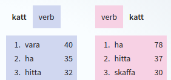

## Introduktion

Detta är en användarhandledning för ordforskningsplattformen [Korp](https://spraakbanken.gu.se/korp/). Prova gärna att
besöka sidan och göra ett par testsökningar innan du läser vidare, så att du får en bild av hur gränssnittet ser ut.

Det finns även ett par övningsuppgifter som du kan ladda hem
[här](https://svn.spraakdata.gu.se/repos/lb/trunk/sbkhs/pub/exercises/korp_ovningsuppgifter-hw17.pdf),
[här](https://svn.spraakdata.gu.se/repos/lb/trunk/sbkhs/pub/exercises/korp_ovningsuppgifter.pdf)
och [här](https://svn.spraakdata.gu.se/repos/lb/trunk/sbkhs/pub/exercises/korp_ovningsuppgifter_2012.pdf).

Korp låter dig söka i stora mängder med textmaterial från olika källor, såsom skönlitteratur, dagstidningar,
sociala medier och myndighetstexter. Texterna har försetts med extra information, så kallad annotering. Detta har
för de flesta korpusar gjorts automatiskt, vilket betyder att annoteringen kan innehålla fel.

## Olika korpar

Materialet i Korp är uppdelat i ett antal olika "lägen". När man först kommer till Korp visas läget med nusvenskt
material, från 1900-talet och framåt.
Överst på sidan, ovanför logotypen, finns det länkar till de andra lägena, med bland annat 1800-talsmaterial och
parallella korpusar och material på andra språk. Funktionaliteten
mellan dessa olika lägen kan skilja något, och nedanstående beskrivning gäller främst det moderna materialet.

## Korpusväljaren

Till höger om Korp-logotypen finns *korpusväljaren*. Det är med hjälp av den man väljer vilka material man är intresserad
av att söka i. Korpusarna ligger sorterade i kategorier, och man väljer eller väljer bort korpusar genom att kryssa i
eller ur rutan framför varje korpusnamn.

När man klickar på den blå info-ikonen till höger om ett korpusnamnet får man även fram information om den, bland annat 
dess storlek i antal token och antal meningar.

Ovanför korpusarna finns det en tidslinje med staplar, som ger en överblick över materialets fördelning över tid.
Markerade korpusar syns som blå staplar, medan ej markerade syns som grå. Allt material innehåller inte information
om tid, och därför finns det längst till höger även en röd stapel, som representerar allt odaterat material.

## Sökning

Gränssnittet i Korp är uppdelat i två huvudsakliga delar: en övre del i vilken sökningar utförs, samt en nedre del där 
sökresultaten presenteras. Sökdelen är i sin tur uppdelad i tre olika versioner: *Enkel*, *Utökad* och *Avancerad*, som
var och en låter en utföra sökningar men med olika grad av komplexitet.
Fliken *Enkel* är den simplaste, där endast enkla sökningar på ord eller fraser går att utföra, medan *Utökad* 
innehåller verktyg för att bygga ihop mer komplicerade frågor.
*Avancerad* ger en ytterligare möjligheter men kräver att man är insatt i det frågespråk som Korp använder (CQP).

### Enkel sökning

I en enkel sökning kan man söka på antingen ett ord, flera ord, eller ett *lemgram*. Ett lemgram är ett ords eller ett flerordsuttrycks samtliga böjningsformer, och gör det
möjligt att i en och samma sökning söka efter både "katt", "katter", "katterna" och så vidare. Läs mer på [Vad är ett lemgram?](https://spraakbanken.gu.se/faq/vad-ar-ett-lemgram)

För att göra en vanlig ordsökning skriver man ordet eller orden i sökfältet och trycker på Sök-knappen eller Enter-tangenten på tangentbordet. Om man i stället för
att direkt trycka på Sök väntar lite efter att man har skrivit ett komplett ord, så kommer det upp en lista under sökfältet över lemgram i vilka det inmatade ordet är en ordform.
För att göra en lemgramsökning väljer man ett av dessa med piltangenterna samt Enter, och trycker därefter Enter igen för att utföra sökningen.

Under sökfältet finns ett antal kryssrutor med inställningsmöjligheter för ens sökning.

**I fri följd**

Vid sökning på fler än ett ord görs som standard en frassökning, vilket innebär att man enbart får träffar där sökorden
förekommer i exakt den ordning man angivit, och direkt efter varandra.
Genom att kryssa i rutan *i fri följd* söks det i stället efter meningar som innehåller samtliga
sökord, i valfri ordning och inte nödvändigtvis intill varandra.

**Förled och efterled**

Kryssrutorna *förled* och *efterled* utökar ens sökning till att även inkludera ord där det sökta ordet
eller orden förekommer som del av ett annat ord.

Vid vanlig ordsökning betyder detta helt enkelt att man söker på ord som innehåller den givna teckensekvensen i början eller i slutet.

Vid lemgramsökning används i stället en sammansättningsanalys som varje ord genomgått.

**Skiftlägesoberoende sökning**

Utöver kryssrutorna för förled och efterled så finns det även en kryssruta för *skiftlägesoberoende* sökning. Om denna är
ikryssad innebär det att om man söker på till exempel "katt", så kommer man även att få träffar som "KATT" och "Katt". Det görs
alltså ingen skillnad på stora och små bokstäver. Detta har ingen effekt vid en lemgramsökning, eftersom de alltid är skiftlägesoberoende.

**Relaterade ord**

När en lemgramsökning har utförts dyker det upp en knapp längst till höger, som leder till en lista över relaterade ord.
Genom att klicka på dessa ord kan man utföra nya sökningar.

### Utökad sökning

Utökad-fliken låter en bygga ihop mer avancerade sökuttryck. Varje grå "låda" motsvarar ett *token* (vilket är ungefär samma
sak som ett ord, men som även inkluderar t.ex. skiljetecken), och för varje token
kan man uppge ett eller flera kriterier. För att lägga till ett till token använder man +-knappen till höger, och för att
ta bort ett token använder man x-knappen i övre högra hörnet på varje token (endast synlig om mer än ett token finns). Man
kan även byta ordning på befintliga token genom att med musen klicka och dra dem till önskad plats.

För att definiera sökkriterier för ett token väljer man det attribut i listan som man vill söka baserat på. Som standard söker
man på ord, men här går även att välja ordklass, lemgram med mera. Till höger om listan med attribut finns det en till
lista, där man kan ändra från "är" till "är inte", om man vill skapa negationer. För vissa attribut är det även möjligt
att här välja "börjar med", "slutar med", "innehåller", eller att man vill använda reguljära uttryck.

I textfältet under skriver man sen in önskat värde för attributet. För vissa attribut finns det i stället för ett textfält
en lista över värden man kan välja mellan, och för vissa speciella attribut (*lemgram* och *betydelse*) måste man välja ett värde
ur en lista som kommer upp efter att man har börjat skriva i textfältet.

Till höger om varje textfält finns det en liten symbol: "Aa". Genom att klicka på den kan man stänga av eller sätta på
skiftlägesberoende för just det fältet. Som standard är sökningen skiftlägesberoende, det vill säga att man gör skillnad på
stora och små bokstäver. En sak att tänka på är att skiftlägesoberoende sökning går betydligt långsammare.

Om man har valt "ord" men lämnar textfältet tomt, så motsvarar det *Vilket ord som helst*, vilket alltså matchar samtliga token.

För varje token är det möjligt att uppge flera kriterier, på formen *(A eller B eller C) och (E eller F) och ...*. Den ljusa
rutan inom den grå representerar en grupp med *eller*-kriterier, och för att lägga till ett nytt trycker man på "eller" nere
i högra hörnet. För att lägga till ett *och* samt en ny *eller*-grupp trycker man på plus-knappen i nedre vänstra hörnet.

**Upprepning, meningsbörjan och meningsslut**

Längst ner i högra hörnet på varje token finns det en menyknapp. Klickar man på denna får man upp en liten meny
med ytterligare kriterier. Det första av dessa, *Upprepa*, låter en ange att aktuellt token får upprepas ett visst antal gånger.
Ett token med till exempel *Vilket ord som helst* och *Upprepa 1 till 3 gånger* tillåter en "lucka" i ens sökuttryck på minst ett och max tre token.
De två andra kriterierna är *Meningsbörjan* och *Meningsslut*, som lägger till gränskriterier före eller efter tokenet.
Tänk på att skiljetecken också räknas som token, vilket innebär att att sista tokenet i en mening oftast är en punkt och inte ett ord.

**Sök över meningsgränser**

Som standard utförs alla sökningar *inom* meningsgränserna, vilket betyder att man aldrig kommer att få en
träff som sträcker sig utanför en mening. För vissa korpusar finns det dock möjlighet att i stället tillåta träffar som spänner
över en större mängd text, till exempel ett stycke, vilket gör det möjligt att söka över meningsgränser.

Alternativet för att aktivera detta hittar man precis till höger om Sök-knappen vid Utökad sökning. Om den eller de korpusar man har valt inte stöder
utökad kontext, så kommer det här inte gå att välja något annat än "mening". Har man däremot valt minst en korpus som tillåter
utökad kontext så kommer man kunna välja det i listan. Om bara en del av de valda korpusarna har detta stöd så kommer det stå
något i stil med "upp till stycke". Detta innebär att sökningen kommer ske inom styckesgränsen *för de korpusar som stöder det*, och största
möjliga kontext som är mindre än ett stycke, för de som inte stöder det, vilket i de flesta fall kommer vara en mening.

**Parallellsökning**

Vissa av korpusarna i Korp är så kallade parallellkorpusar, som består av två versioner av samma text som är länkade sinsemellan
på meningsnivå. Oftast rör det sig om texter på två olika språk. Sökresultatet från en sådan korpus kommer bestå av
*par* av meningar, en för varje version av texten. För att kunna utföra parallellsökningar måste man först växla till det
parallella läget i Korp, via länken "Parallella" högst upp på sidan.

Parallellsökning går enbart att utföra med Utökad sökning. Detta fungerar till största del som en vanlig sökning,
med skillnaden att man nu har möjlighet att välja vilken eller vilka av språkversionerna man vill söka i. Detta görs i en språkmeny ovanför
första tokenrutan. Det går även att söka parallellt i båda språken genom att trycka på knappen "Fler språk" nere vid Sök-knappen. Detta
lägger till en extra rad med token, i vilken man kan ange sökkriterier för det andra språket. En sökning gjord på detta vis
betyder att dina sökkriterier måste uppfyllas av båda språken i varje meningspar för att en träff ska hittas. Man kan till exempel
med en svensk-engelsk översättningskorpus söka efter länkade par där den svenska delen måste innehålla ordet "älg", medan den engelska
måste innehålla "elk". Man kan också genom att kryssa i rutan "Innehåller inte" säga att man bara vill ha de träffar där
ordet "elk" *inte* förkommer i den engelska delen.

För vissa korpusar finns det utöver meningslänkning även *ordlänkning*. Genom att markera ett ord på ena språket kan man då se vilket
eller vilka ord i andra språket som detta ord motsvarar. Observera att ordlänkningen i regel är automatiskt utförd och därför inte är helt
tillförlitlig.

### Avancerad sökning

Oavsett om man använder Enkel eller Utökad sökning så omvandlas ens fråga till ett uttryck i frågespråket CQP Query Language. På fliken
*Avancerad* kan man både se hur de skapade uttrycken för Enkel och Utökad ser ut, samt konstuera en egen sökfråga om man vill
göra något som är mer avancerat än vad som för närvarande är möjligt i en Utökad sökning.

För att läsa mer om frågespråket, se:

- [Att söka i Korp med CQP och Regexp – en introduktion (pdf)](https://www.gu.se/sites/default/files/2021-03/Att%20so%CC%88ka%20i%20Korp%20med%20CQP%20och%20Regexp.pdf) (Klas Hjortstam, 2018)
- [CQP Interface and Query Language Manual (pdf)](https://cwb.sourceforge.io/files/CQP_Manual.pdf) (Stephanie Evert & The CWB Development Team, 2022)

### Visningsalternativ

Oberoende av vilken version av sökgränssnittet man använder så finns det en rad med *visningsalternativ*, placerade längst ner i en rand
under sökfälten. Här kan man ställa in olika visningsalternativ för sökresultatet. För KWIC:en kan man välja antalet träffar
per sida, samt sorteringsordning. Sorteringen kan ske antingen efter höger- eller vänsterkontext, på själva träffen i sig, eller slumpvis. Sorteringen sker
enbart inom varje korpus. Med standardvalet "förekomst" kommer träffarna visas i den ordning
de förekommer i korpusen, vilket i många fall är en delvis slumpvis ordning av upphovsrättsliga skäl.

För statistiken går det att välja vilket attribut statistiken ska sammanställas på.

Det är även möjligt att inaktivera vissa funktioner i resultatvyn, som t.ex. statistik, om man inte är intresserad av statistik och vill
snabba upp sina sökningar något.

## Sökresultat

Resultatvyn, som visas först efter att en sökning har utförts, är uppdelad i tre olika avdelningar: *KWIC*, *Statistik* och *Ordbild*.

### KWIC

KWIC, som står för "keyword in context", visar det sökta ordet eller orden i sin kontext, vanligtvis en mening. Sökresultaten, om de är många, är
uppdelade på ett antal sidor, och för att bläddra mellan sidorna använder man tangenterna *f* respektive *n* på tangentbordet.

Förutsatt att man har sökt i mer än en korpus, kommer det till höger om texten som anger hur många träffar sökningen gav finnas en färgad remsa. Denna
visar med alternerande färger storleksförhållandet mellan träffmängden i de olika korpusarna, och genom att föra musen över dem ser man vilken
korpus varje bit representerar. För att snabbt komma till den träffsida där träffarna från en viss korpus börjar, klickar man på önskad korpus
i denna remsa.

Sökträffarna är grupperade efter korpus, och vilken korpus de efterföljande träffarna kommer från står skrivet med liten rubrik ovanför.

Längst ner på sidan under KWIC-raderna, finns möjligheten att exportera den aktuella sidans träffar i olika format för nedladdning.

**Större kontext**

I vissa korpusar är det möjligt att få se en större kontext än bara en mening. Vanligtvis rör det sig om hela stycken. För att visa eventuell större
kontext klickar man på länken "Via kontext" till höger om sidbläddraren. Detta växlar till en alternativ träffsida, där större kontext visas i de fall
det är möjligt, och varje träffrad är radbruten för enklare läsning. I övrigt fungerar kontextläget precis som det vanliga KWIC-läget.

**Sidopanelen**

Genom att klicka på token i KWICen kan man markera ord, och när ett ord har markerats visas till höger en sidopanel. Denna sidopanel
innehåller både information om det markerade ordet (under rubriken *Ordattribut*), och eventuellt också den mening eller större text som ordet ingår i (under *Textattribut*).
Ordattributen är information som ordklass, grundform, sammansättningsanalys med mera, medan textattributen kan vara författare, utgivninsår och liknande.

Vissa attribut är klickbara. Klickar man t.ex. på ett lemgram, så utförs en ny sökning på det lemgrammet. När man för musen över många klickbara attribut
dyker det till höger upp en liten länk som i en ny webbläsarflik tar en till *Karp*, Språkbankens sökgränssnitt för lexikala resurser.

När ett ord är markerat markeras även dess syntaktiska huvud i samma mening, med en ljusröd bakgrund.

### Statistik

Statistik-fliken visar en tabell där varje kolumn motsvarar en korpus, och raderna utgörs av de olika värden som sökningen matchat. Som standard
sammanställs statistiken på ordformer, och vid en enkel
sökning på endast ett ord kommer det därför bara finnas en rad, medan en sökning på ett lemgram i stället ger en rad per ordform som förekommer i materialet.
Bland visningsalternativen kan man välja att sammanställa statistiken på andra attribut än ordform, till exempel ordklass eller något textattribut, samt om
sammanställningen ska vara skiftlägesberoende eller ej.

Genom att klicka på sökträfftexten i en resultatrad i tabellen, öppnas en ny KWIC-flik med de meningar som legat till grund för just den statistikraden.

Tabellens celler visar antalet förekomster i varje korpus, både i absoluta tal (inom parentes) och relativa tal. De relativa talen visar antal träffar per en miljon token.
Genom att klicka på kolumnernas rubriker kan man sortera tabellen i stigande eller fallande ordning efter vald kolumn.

Precis till vänster om totalkolumnen finns det en liten symbol på varje rad, som låter en öppna ett cirkeldiagram där man kan se fördelningen av träffarna
i de olika korpusarna. Här kan man också växla mellan att visa diagram för absoluta eller relativa tal.

Längst ner på sidan, under tabellen, finns möjligheten att exportera statistiktabellen i olika format för nedladdning.

**Trenddiagram**

Om någon av korpusarna man har sökt i innehåller tidsinformation, är det möjligt att ta fram ett trenddiagram. Trenddiagrammet utgår från rader i statistiktabellen,
och visar förändringen av dessa raders relativa frekvens över tid. Den relativa frekvensen i diagrammet visar antalet träffar per en miljon token för varje specifik tidsenhet.

För att komma till trenddiagrammet väljer man först ut en eller flera rader från statistiken med hjälp av kryssrutorna längst till vänster i tabellen, och därefter klickar man
på knappen *Visa trenddiagram*. En ny flik kommer då öppnas, innehållande ett linjediagram. Diagrammets horisonella axel visar tid, medan den vertikala axeln visar relativ frekvens.
Varje linje i diagrammet motsvarar en vald rad i statistiktabellen, och i teckenförklaringen längst till höger går det att kryssa i och ur vilka linjer man vill visa. Genom att
klicka på en punkt på en linje, öppnas en ny flik med alla träffar för just den tidpunkten.

Under trenddiagrammet finns en miniatyrversion av diagrammet, med handtag som låter en zooma in och panorera runt i det stora diagrammet. Upplösningen på trenddiagrammets tidaxel
bestäms av storleken på det tidsspann som visas, och genom att zooma in går det att visa tidsinformation ner på sekundnivå, förutsatt att det valda materialet har stöd för det.

**Karta**

Kartfunktionen utgår likt trenddiagrammet från rader i statistiktabellen. Du når den genom att kryssa för en eller flera
rader i statistiken med hjälp av kryssrutorna längst till vänster i tabellen, och därefter klicka på knappen "Visa karta".
I den meny som då fälls ut väljer du vilket attribut du vill basera kartan på. För de flesta korpusar är det endast möjligt
att basera kartan på samförekomst med platsnamn på menings- eller styckesnivå, dvs den tittar på sökträffens kontext och
letar efter platser där. Men för vissa korpusar finns det även platsinformation angiven som metadata, t.ex. en bloggares
hemort, och då är det möjligt att basera kartan på den informationen i stället.

Efter att du gjort ditt val och klickat på "Visa karta"-knappen kommer en ny kartflik öppnas.

### Ordbild

Ordbildsfunktionen är som standard inaktiverad, och måste först aktiveras genom att kryssa i rutan "Visa ordbild" bland sökinställningarna.
Ordbildsfliken är endast aktiv då man från *Enkel* sökning har sökt på ett *ensamt ord* eller ett *lemgram*. Här visas det sökta ordet tillsammans med ord som det har
olika syntaktiska relationer till i materialet, grupperat efter relation. För ett verb visas till exempel de subjekt och objekt som är särskilt utmärkande för just det
verbet, och för ett substantiv visas utmärkande attribut, och verb som substantivet är subjekt och objekt till.

Intill varje relaterat ord finns ett mått på sambandet till sökordet inom det valda materialet.
Du kan välja att visa och sortera på absolut frekvens (antal) eller Lexicographer's Mutual Information (LMI).
LMI är ett värde som mäter frekvensen av ett givet ordpar i förhållande till frekvenserna av varje ord i paret.
På så vis reduceras ord som samförekommer ofta bara för att de är vanliga i allmänhet, såsom "vara" och "ha".

Genom att klicka på ett ord i tabellen kan man få fram en ny KWIC-flik med alla de meningar i vilka vald relation förekommer.

## Jämförelser

Det är möjligt att göra en log-likelihood-jämförelse av resultatet från två sökningar. För att göra en sådan jämförelse behöver man först spara två sökningar.
Detta gör man från valfri sökflik, genom att först skapa sitt sökuttryck, och sen klicka på pilen till höger om Sök-knappen. Detta låter en spara själva sökningen med ett valfritt namn,
i stället för att utföra den. När man har två sökningar sparade kan man gå till fliken *Jämförelse*, som ligger till höger om de tre sökflikarna.
Här väljer man de två sökningar man vill jämföra, och därefter vilket attribut som jämförelsen ska utföras på. Ett exempel på en jämförelse är de två sökningarna
*alla substantiv i romaner* och *alla substantiv i nyhetstexter*, med sammanställning på *grundform*. När denna jämförelse är klar presenteras två kolumner med grundformer:
den första listar de grundformer som är mest utmärkande för sökning #1, och den andra listar grundformer utmärkande för sökning #2. Kolumnerna är sorterade med de mest
urmärkande orden överst. Siffrorna till höger visar absolut frekvens.

## Andra användarmanualer

Det finns användarmanualer för andra instanser av Korp, t.ex. instansen på Kielipankki, här hittar man dem (enbart på engelska):

- https://www.kielipankki.fi/support/korp/
- https://www.kielipankki.fi/support/korp-advanced
